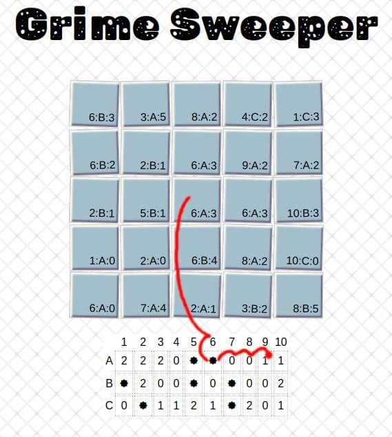

# Grimesweeper
A printable Minesweeper game for kids

## [PAGE LINK](http://internetimagery.com/grimesweeper/)

## How does it work?

First, pick a board size using the inputs on the webpage. Adding more bombs relative to the board size will make things harder.
Print off the page. Or print multiple.

The game plays the same as minesweeper. Pick a square. Get a number that represents how many -bombs- messes are next to that square, including diagonal.
Figure out where the -bombs- messes are without selecting the square directly. Write the numbers on the page.

When selecting a square to check. There are three coordinates. Number:Letter:Number.

* Use the smaller reference grid below the main grid to get the number.
* Find the column that matches the first number.
* Next find the row that matches the next letter. Get the intersecting cell.
* Finally count from the cell to the right (going to the next row down as if reading left to right) cells equalling the final number.

Example:

* Player chooses the square marked `6:A:3`
* First we check the column numbered `6` on the reference grid below.
* Next we check the row marked `A` on the same grid. Top row in this case.
* Finally we move to the right `3` spaces. As if reading left to right.
* This puts us into a cell with a `1`. This is our final number. Write the number in the cell. This means there is one mess touching this square (possible on diagnonal).
* Pick a new square and repeat the process.

